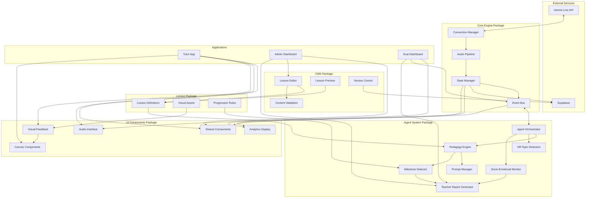
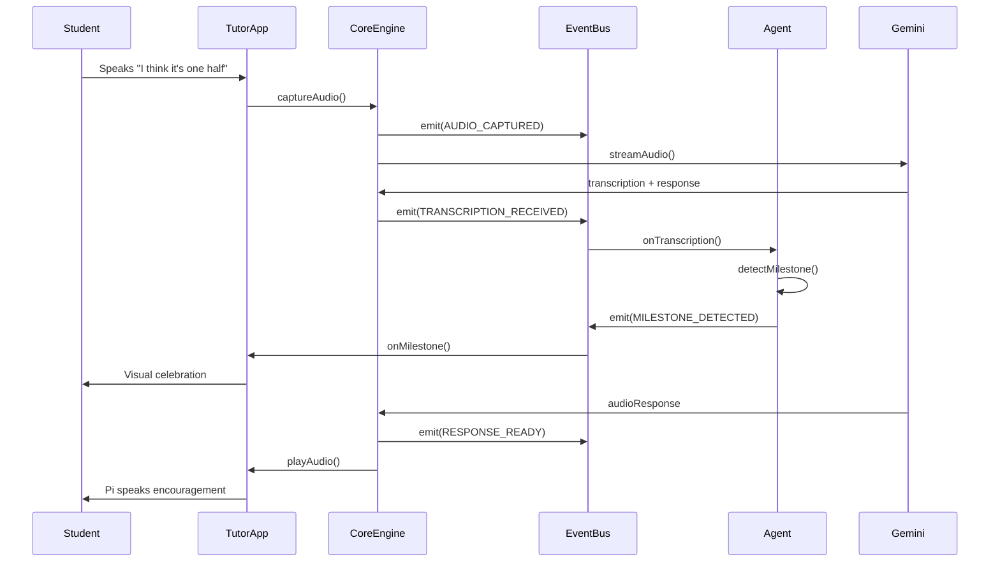
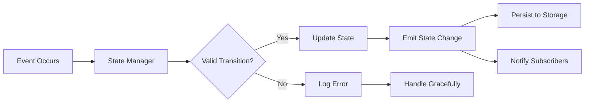

# Simili Monorepo Architecture - Project Brief

## Project Overview

**Goal:** Create a modular monorepo architecture for Simili (AI voice math tutor) that enables rapid iteration on front-end interaction patterns while maintaining stable, testable components for Gemini Live integration and agentic behavior.

**Key Principle:** Build a learning research platform that optimizes for measurability, testability, and iteration speed.

---

## Core Architectural Requirements

### 1. Separation of Concerns
Each system component must be independently swappable:
- **Gemini Live Connection Layer** - WebSocket management, audio streaming, model configuration
- **Agent System** - Pedagogical logic, milestone detection, lesson progression, teacher reports, off-topic detection, socio-emotional monitoring
- **System Prompts** - Teacher personality, instructional strategies, adaptations
- **Front-End Patterns** - UI components, interaction flows, visual feedback (possibly TLDraw canvas)
- **Lesson Content** - Learning objectives, progression rules, visual assets
- **CMS** - Content management for lessons, editable by non-engineers

### 2. Event-Driven Communication
- No direct coupling between components
- All state changes emit events
- Enables comprehensive logging, session replay, and debugging
- Supports A/B testing and experimentation

### 3. Observable State Management
- All state is explicit, serializable, and external to components
- Enable pause/resume, time-travel debugging, and pattern analysis
- Support real-time monitoring and intervention

### 4. Evaluation-Ready from Day One
- Built-in instrumentation for pedagogy research
- Automatic metrics collection at every decision point
- Support for automated and human evaluation workflows

---

## Tech Stack

### Core Technologies
- **React** - UI framework (no Next.js)
- **TypeScript** - Strict mode throughout
- **Gemini Live API** - Real-time voice interaction
- **Supabase** - Data storage and backend services
- **TLDraw** (optional) - Canvas-based visual interactions

### AI/Agent Technologies
- **DSPy** (possible) - Structured prompting and optimization
- **A2A** (possible) - Agent-to-agent communication patterns

**Note on DSPy Integration**: If using DSPy, it should be integrated within the `agents` package, specifically in the `pedagogy` and `prompts` modules. DSPy optimizers would live alongside the PromptManager and could be used for automatic prompt tuning based on eval metrics.

**Note on A2A Integration**: If implementing agent-to-agent patterns (e.g., a "tutor agent" coordinating with a "socio-emotional support agent"), the architecture in `agents/orchestrator` should support multi-agent coordination with clear message passing protocols.

### Content Management
- **Custom CMS** - Initial implementation for lesson management
- Architecture should support future migration to 3rd-party CMS

**CMS Migration Strategy**: The `cms` package should expose a clean API contract that the rest of the system depends on. This abstraction layer ensures that if you later migrate to a 3rd-party CMS (e.g., Contentful, Sanity, Strapi), only the `cms` package internals need to change—not the consuming applications. Key interfaces to abstract:
- Lesson CRUD operations
- Asset management (upload, retrieve, organize)
- Version control operations
- Content validation rules

### Authentication
- **Plug-and-play design** - Not implemented initially, but architected for easy integration

### Deployment
- **Web-only** for initial release
- Architecture should not preclude mobile/desktop expansion

---

## High-Level System Architecture



---

## Proposed Monorepo Structure

```
simili-monorepo/
│
├── packages/
│   │
│   ├── core-engine/                 # Gemini Live + Orchestration
│   │   ├── src/
│   │   │   ├── connection/          # WebSocket & model config
│   │   │   │   ├── GeminiClient.ts
│   │   │   │   ├── ConnectionManager.ts
│   │   │   │   └── ModelConfig.ts
│   │   │   │
│   │   │   ├── audio/               # Audio pipeline
│   │   │   │   ├── AudioCapture.ts
│   │   │   │   ├── AudioPlayback.ts
│   │   │   │   └── AudioProcessor.ts
│   │   │   │
│   │   │   ├── state/               # State management
│   │   │   │   ├── StateManager.ts
│   │   │   │   ├── StateSerializer.ts
│   │   │   │   └── StateStore.ts
│   │   │   │
│   │   │   ├── events/              # Event system
│   │   │   │   ├── EventBus.ts
│   │   │   │   ├── EventLogger.ts
│   │   │   │   └── EventTypes.ts
│   │   │   │
│   │   │   └── index.ts
│   │   │
│   │   ├── tests/
│   │   ├── package.json
│   │   └── tsconfig.json
│   │
│   ├── agents/                      # Agent Logic & Behavior
│   │   ├── src/
│   │   │   ├── orchestrator/        # Main agent coordinator
│   │   │   │   ├── AgentOrchestrator.ts
│   │   │   │   └── SessionManager.ts
│   │   │   │
│   │   │   ├── pedagogy/            # Teaching logic
│   │   │   │   ├── PedagogyEngine.ts
│   │   │   │   ├── AdaptiveLogic.ts
│   │   │   │   └── ScaffoldingRules.ts
│   │   │   │
│   │   │   ├── prompts/             # System prompts
│   │   │   │   ├── PromptManager.ts
│   │   │   │   ├── templates/
│   │   │   │   │   ├── base-personality.yaml
│   │   │   │   │   ├── scaffolding-strategies.yaml
│   │   │   │   │   └── error-recovery.yaml
│   │   │   │   └── PromptRenderer.ts
│   │   │   │
│   │   │   ├── milestones/          # Progress detection
│   │   │   │   ├── MilestoneDetector.ts
│   │   │   │   ├── ConceptChecker.ts
│   │   │   │   └── ConfidenceScorer.ts
│   │   │   │
│   │   │   ├── off-topic/           # Off-topic detection & allowance
│   │   │   │   ├── OffTopicDetector.ts
│   │   │   │   ├── TopicClassifier.ts
│   │   │   │   └── RedirectionStrategies.ts
│   │   │   │
│   │   │   ├── socio-emotional/     # Student emotional state
│   │   │   │   ├── EmotionalMonitor.ts
│   │   │   │   ├── FrustrationDetector.ts
│   │   │   │   ├── EngagementTracker.ts
│   │   │   │   └── InterventionTriggers.ts
│   │   │   │
│   │   │   ├── reporting/           # Teacher reports
│   │   │   │   ├── ReportGenerator.ts
│   │   │   │   ├── ProgressSummary.ts
│   │   │   │   ├── StruggleAnalysis.ts
│   │   │   │   └── RecommendationEngine.ts
│   │   │   │
│   │   │   └── index.ts
│   │   │
│   │   ├── tests/
│   │   ├── package.json
│   │   └── tsconfig.json
│   │
│   ├── lessons/                     # Lesson Content & Rules
│   │   ├── src/
│   │   │   ├── definitions/         # Lesson configs
│   │   │   │   ├── fractions/
│   │   │   │   │   ├── lesson-1-chocolate.json
│   │   │   │   │   ├── lesson-2-pizza.json
│   │   │   │   │   └── lesson-3-waffle.json
│   │   │   │   └── schema.ts
│   │   │   │
│   │   │   ├── assets/              # Visual content
│   │   │   │   ├── images/
│   │   │   │   ├── animations/
│   │   │   │   └── sounds/
│   │   │   │
│   │   │   ├── progression/         # Lesson flow rules
│   │   │   │   ├── ProgressionEngine.ts
│   │   │   │   ├── PrerequisiteChecker.ts
│   │   │   │   └── DifficultyAdapter.ts
│   │   │   │
│   │   │   ├── loader/              # Content loading
│   │   │   │   └── LessonLoader.ts
│   │   │   │
│   │   │   └── index.ts
│   │   │
│   │   ├── tests/
│   │   ├── package.json
│   │   └── tsconfig.json
│   │
│   ├── cms/                         # Content Management System
│   │   ├── src/
│   │   │   ├── editor/              # Lesson editor
│   │   │   │   ├── LessonEditor.tsx
│   │   │   │   ├── AssetUploader.tsx
│   │   │   │   ├── ProgressionBuilder.tsx
│   │   │   │   └── MilestoneEditor.tsx
│   │   │   │
│   │   │   ├── preview/             # Lesson preview
│   │   │   │   ├── LessonPreview.tsx
│   │   │   │   └── InteractiveSimulator.tsx
│   │   │   │
│   │   │   ├── validation/          # Content validation
│   │   │   │   ├── SchemaValidator.ts
│   │   │   │   ├── RequirementChecker.ts
│   │   │   │   └── QualityAssurance.ts
│   │   │   │
│   │   │   ├── versioning/          # Version control
│   │   │   │   ├── VersionManager.ts
│   │   │   │   ├── ChangeTracker.ts
│   │   │   │   └── RollbackHandler.ts
│   │   │   │
│   │   │   ├── api/                 # Supabase integration
│   │   │   │   ├── LessonRepository.ts
│   │   │   │   ├── AssetStorage.ts
│   │   │   │   └── VersionRepository.ts
│   │   │   │
│   │   │   └── index.ts
│   │   │
│   │   ├── tests/
│   │   ├── package.json
│   │   └── tsconfig.json
│   │
│   ├── ui-components/               # Shared React Components
│   │   ├── src/
│   │   │   ├── audio/               # Audio UI components
│   │   │   │   ├── VoiceVisualizer.tsx
│   │   │   │   ├── MuteButton.tsx
│   │   │   │   └── AudioStatusBar.tsx
│   │   │   │
│   │   │   ├── visual/              # Visual feedback
│   │   │   │   ├── LessonCanvas.tsx
│   │   │   │   ├── ProgressIndicator.tsx
│   │   │   │   ├── MilestoneAnimation.tsx
│   │   │   │   └── ConfidenceDisplay.tsx
│   │   │   │
│   │   │   ├── canvas/              # Canvas-based interactions (TLDraw)
│   │   │   │   ├── DrawingCanvas.tsx
│   │   │   │   ├── AnnotationTools.tsx
│   │   │   │   ├── ShapeRecognition.tsx
│   │   │   │   └── CollaborativeCanvas.tsx
│   │   │   │
│   │   │   ├── layout/              # Layout components
│   │   │   │   ├── AppShell.tsx
│   │   │   │   ├── Navbar.tsx
│   │   │   │   └── Sidebar.tsx
│   │   │   │
│   │   │   ├── analytics/           # Analytics display
│   │   │   │   ├── SessionMetrics.tsx
│   │   │   │   ├── LatencyChart.tsx
│   │   │   │   ├── EmotionalStateGraph.tsx
│   │   │   │   └── EventTimeline.tsx
│   │   │   │
│   │   │   └── index.ts
│   │   │
│   │   ├── stories/                 # Storybook stories
│   │   ├── tests/
│   │   ├── package.json
│   │   └── tsconfig.json
│   │
│   ├── eval-tools/                  # Evaluation & Analytics
│   │   ├── src/
│   │   │   ├── metrics/             # Metrics calculation
│   │   │   │   ├── LatencyMetrics.ts
│   │   │   │   ├── PedagogyMetrics.ts
│   │   │   │   └── EngagementMetrics.ts
│   │   │   │
│   │   │   ├── replay/              # Session replay
│   │   │   │   ├── SessionReplayer.ts
│   │   │   │   └── EventPlayer.ts
│   │   │   │
│   │   │   ├── analysis/            # Data analysis
│   │   │   │   ├── PatternDetector.ts
│   │   │   │   ├── ABTestAnalyzer.ts
│   │   │   │   └── CohortAnalysis.ts
│   │   │   │
│   │   │   └── index.ts
│   │   │
│   │   ├── tests/
│   │   ├── package.json
│   │   └── tsconfig.json
│   │
│   └── shared/                      # Shared utilities
│       ├── src/
│       │   ├── types/               # TypeScript types
│       │   ├── utils/               # Utility functions
│       │   └── constants/           # Shared constants
│       ├── tests/
│       ├── package.json
│       └── tsconfig.json
│
├── apps/
│   │
│   ├── tutor-app/                   # Student-Facing Application
│   │   ├── src/
│   │   │   ├── pages/               # React Router pages
│   │   │   │   ├── Home.tsx
│   │   │   │   ├── Lesson.tsx
│   │   │   │   └── Profile.tsx
│   │   │   │
│   │   │   ├── components/          # App-specific components
│   │   │   ├── hooks/               # App-specific hooks
│   │   │   └── lib/                 # App utilities
│   │   │
│   │   ├── public/
│   │   ├── index.html
│   │   ├── vite.config.ts
│   │   ├── package.json
│   │   └── tsconfig.json
│   │
│   ├── admin-dashboard/             # Content Management & Teacher Dashboard
│   │   ├── src/
│   │   │   ├── pages/
│   │   │   │   ├── Dashboard.tsx
│   │   │   │   ├── LessonManagement.tsx  # CMS interface
│   │   │   │   ├── PromptEditor.tsx
│   │   │   │   ├── StudentReports.tsx    # Teacher reports
│   │   │   │   └── StudentManagement.tsx
│   │   │   │
│   │   │   ├── components/
│   │   │   ├── hooks/
│   │   │   └── lib/
│   │   │
│   │   ├── public/
│   │   ├── index.html
│   │   ├── vite.config.ts
│   │   ├── package.json
│   │   └── tsconfig.json
│   │
│   └── eval-dashboard/              # Research & Analytics
│       ├── src/
│       │   ├── pages/
│       │   │   ├── Overview.tsx
│       │   │   ├── Sessions.tsx         # Session browser
│       │   │   ├── Experiments.tsx      # A/B test results
│       │   │   └── Metrics.tsx          # Live metrics
│       │   │
│       │   ├── components/
│       │   ├── hooks/
│       │   └── lib/
│       │
│       ├── public/
│       ├── index.html
│       ├── vite.config.ts
│       ├── package.json
│       └── tsconfig.json
│
├── tools/
│   ├── scripts/                     # Build/dev scripts
│   └── config/                      # Shared configs
│
├── docs/
│   ├── architecture/
│   ├── api/
│   └── guides/
│
├── package.json                     # Root package.json
├── turbo.json                       # Turborepo config
├── tsconfig.json                    # Root TypeScript config
└── README.md
```

---

## Key Architecture Patterns

### Event Flow Example



### State Management Pattern



---

## Technical Requirements

### Build System
- **Turborepo** for monorepo management
- **pnpm** for efficient dependency management
- **Vite** for app bundling (tutor-app, admin-dashboard, eval-dashboard)
- **TypeScript** throughout with strict mode
- **ESLint** and **Prettier** for code quality

### Testing Strategy
- **Vitest** for unit tests (fast, modern)
- **Playwright** for E2E tests
- **Storybook** for component development
- **Test coverage** minimum 80% for core packages

### Package Dependencies
```json
{
  "core-engine": {
    "dependencies": ["shared"]
  },
  "agents": {
    "dependencies": ["shared", "core-engine"]
  },
  "lessons": {
    "dependencies": ["shared"]
  },
  "cms": {
    "dependencies": ["shared", "lessons"],
    "note": "Supabase client for data persistence"
  },
  "ui-components": {
    "dependencies": ["shared"],
    "devDependencies": ["@storybook/react"],
    "optional": ["@tldraw/tldraw"]
  },
  "eval-tools": {
    "dependencies": ["shared", "core-engine", "agents"]
  },
  "tutor-app": {
    "dependencies": ["core-engine", "agents", "lessons", "ui-components", "shared"]
  },
  "admin-dashboard": {
    "dependencies": ["agents", "lessons", "cms", "ui-components", "shared"]
  },
  "eval-dashboard": {
    "dependencies": ["eval-tools", "ui-components", "shared"]
  }
}
```

---

## Non-Functional Requirements

### Documentation
Given the modular architecture and need for multiple engineers to work across packages:

- **Package README files** - Every package must have a README explaining:
  - Purpose and responsibilities
  - Key interfaces/exports
  - Usage examples
  - Testing approach

- **Interface documentation** - All public APIs must have:
  - TypeScript interfaces with JSDoc comments
  - Input/output examples
  - Error conditions

- **Architecture decision records (ADRs)** - Document key choices made during setup:
  - Why certain event patterns were chosen
  - How state flows through the system
  - Integration points between packages

- **Setup guide** - Single document explaining:
  - How to run the monorepo locally
  - How to add a new package
  - How to test cross-package integration

**Goal**: Any engineer should be able to understand a package's role and usage within 5 minutes of reading its README.

---

## Success Criteria

The architecture is successful when:

✅ **Swap Gemini for another model** by only changing `core-engine/connection`

✅ **A/B test different prompts** by editing YAML files without code changes

✅ **Change UI** without touching agent logic or Gemini setup

✅ **Replay any session** to debug issues

✅ **Add new lessons** through CMS without touching code

✅ **Non-engineers can create/edit lessons** through admin dashboard

✅ **Teachers get automated reports** on student progress and socio-emotional state

✅ **Off-topic detection** allows for appropriate conversational flexibility

✅ **Measure latency** at every stage (audio capture → transcription → response → playback)

✅ **Run automated evals** on agent pedagogy decisions

✅ **Canvas interactions** (if using TLDraw) integrate seamlessly with voice

✅ **Auth can be plugged in** later without major refactoring

---

## Anti-Patterns to Avoid

❌ **Direct coupling** between packages (always use events/interfaces)

❌ **State mutations without events** (breaks observability)

❌ **Synchronous blocking operations** in audio pipeline (introduces latency)

❌ **Hard-coded prompts** in code (should be YAML files)

❌ **No latency measurement** (can't optimize what you don't measure)

❌ **Sessions without replay** (can't debug effectively)

❌ **Mixing concerns** (e.g., UI logic in agent code)

---

**Document Owner**: [Your Name]  
**Last Updated**: [Date]  
**Status**: Ready for Implementation